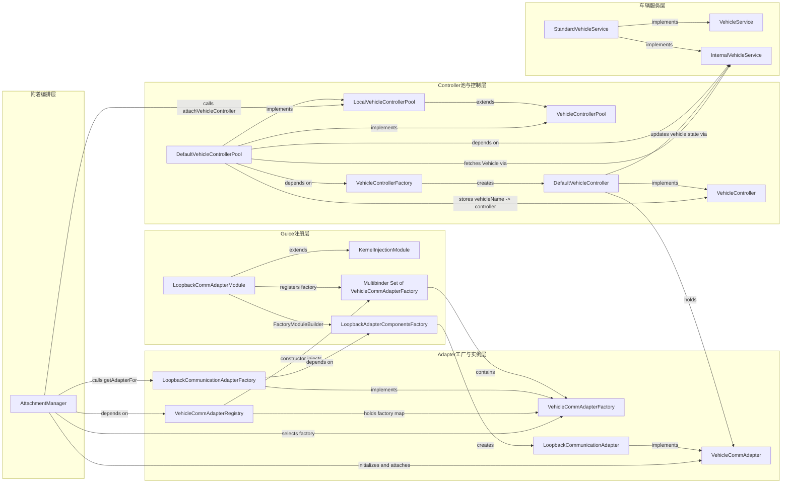

[toc]
***

# 提示词
## 执行约束（文件读写规则）
1. 读取当前整个 Markdown 文件完整内容，仅解析本 `# 提示词` 区块内所有需求、前置链路文本；
2. 所有分析输出内容**禁止覆盖、修改、删除原有任何文本**，仅在本文件 `# 提示词` 章节**后方全新追加独立章节**；
3. 新增章节标题由你根据输出内容自动生成，层级结构自洽（一级/二级标题合理划分），整体内容贴合 openTCS 源码分析场景；
4. 输出格式统一使用标准 Markdown，树形链路、组件表格、代码绑定片段保持清晰可阅读。

## 角色定位
你是 openTCS 内核源码资深工程师，精通 Guice 依赖注入、VehicleCommAdapter 全生命周期、Controller 池绑定、Multibinder 多实例注册机制，能完成源码链路校验、流程标准化梳理、分层架构建模、组件依赖关系拆解。

## 前置背景：人工梳理的 LoopbackCommunicationAdapter 注册&实例化完整调用链路
```
【完整追踪链路原文】
TransportOrderUtil.assignTransportOrder()
    vehicleControllerPool.getVehicleController()
        vehicleControllerPool 声明接口 VehicleControllerPool，运行时实现 DefaultVehicleControllerPool（Guice绑定：bind(VehicleControllerPool.class).to(DefaultVehicleControllerPool.class)）
        DefaultVehicleControllerPool.getVehicleController() 返回 VehicleController 接口实例，实例存储在内部 Map poolEntries
        poolEntries 元素通过 attachVehicleController(vehicleName, commAdapter) 插入
        DefaultVehicleControllerPool.attachVehicleController(vehicleName, commAdapter)
            VehicleController controller = vehicleManagerFactory.createVehicleController(vehicle, commAdapter);
                vehicleManagerFactory 接口 VehicleControllerFactory，Guice生成代理，产出 DefaultVehicleController
```
### attachVehicleController 入参 commAdapter 溯源
```
全局检索 attachVehicleController，唯一有效调用方：AttachmentManager
AttachmentManager.initialize()
    autoAttachAllAdapters()
        attachAdapterToVehicle(vehicleName, factory)
            commAdapter = factory.getAdapterFor(vehicle) // factory 为 VehicleCommAdapterFactory 接口
            controllerPool.attachVehicleController(vehicleEntry.getVehicle().getName(), commAdapter)
                controllerPool 声明 LocalVehicleControllerPool，实现同样 DefaultVehicleControllerPool
```
### factory 溯源
```
factories = commAdapterRegistry.findFactoriesFor(vehicle)
factory = factories.get(0)
commAdapterRegistry 类型 VehicleCommAdapterRegistry，Guice构造注入 Set<VehicleCommAdapterFactory> factories
VehicleCommAdapterRegistry 构造函数：遍历注入的 factories 存入本地Map
```
### Guice 多绑定注册适配器工厂
```
Multibinder<VehicleCommAdapterFactory> vehicleCommAdaptersBinder()
vehicleCommAdaptersBinder().addBinding().to(LoopbackCommunicationAdapterFactory.class);
LoopbackCommunicationAdapterFactory 实现 VehicleCommAdapterFactory
LoopbackCommunicationAdapterFactory.getAdapterFor(Vehicle vehicle):
    return adapterFactory.createLoopbackCommAdapter(vehicle);
adapterFactory 接口 LoopbackAdapterComponentsFactory，Guice实现产出 LoopbackCommunicationAdapter（VehicleCommAdapter 标准实现类）
```
### 最终结论
```
attachVehicleController 传入的 commAdapter 实际实例为 LoopbackCommunicationAdapter
```

## 三大核心任务
### 任务1：源码链路评审 & 标准化书写规范优化
1. 对照 openTCS 内核完整源码，逐条校验上方人工追踪逻辑是否存在错误、遗漏、逻辑断层；标出所有不准确/缺失代码节点并给出修正；
2. 指出当前手写链路文本混乱、可读性差的根源，输出两套标准化写法：①线性调用溯源文本版 ②分层流程大纲版；
3. 提炼通用组件追踪 Markdown 模板，后续任意 commAdapter 溯源均可复用。

### 任务2：梳理适配器完整分层架构（树形结构输出）
痛点：多层工厂嵌套、Guice注入链路冗长，每次溯源耗时极高。
1. 划分从【Guice模块注册→工厂注册→适配器实例创建→绑定VehicleController→存入ControllerPool】完整五层架构，每层标注职责、上下游依赖；
2. 使用缩进树形文本输出完整组件依赖链：Multibinder → Registry → Factory → CommAdapter → AttachmentManager → ControllerPool → VehicleController；
3. 输出快速新增/替换自定义 commAdapter 的标准修改步骤，基于架构明确所有改动点位，无需完整复现全链路追踪。

### 任务3：拆解车辆管控核心组件层级与依赖关系
待梳理组件：VehicleControllerPool、DefaultVehicleControllerPool、VehicleController、DefaultVehicleController、VehicleControllerFactory(vehicleManagerFactory)、VehicleService
1. 区分四类组件：接口/实现类/工厂/容器/业务服务，自上而下划分层级；
2. 梳理单向依赖、Guice注入绑定、数据流转方向，明确谁持有谁、谁由谁创建；
3. 结构化列表整理每个组件核心职责，厘清池、工厂、控制器混淆点。

## 输出格式强制要求
1. 新增章节逻辑顺序：先链路评审结论 → 标准化书写模板 → 适配器分层架构树 → 自定义适配器扩展步骤 → 车辆组件层级依赖拆解；
2. 代码、Guice绑定片段使用 ```java 代码块包裹；
3. 架构树、组件关系使用 Markdown 缩进列表；
4. 全程使用 openTCS 官方标准类名、Guice 专业术语，分段清晰，杜绝大段无分隔文字；
5. 所有分析内容统一追加在本 `# 提示词` 章节之后，独立一级标题，不和原有文字混排。
# LoopbackCommunicationAdapter 源码链路校验与标准化梳理

## 1. 链路评审结论

### 1.1 总体结论

人工梳理链路的主干方向是正确的：调度侧通过 `VehicleControllerPool` 取得 `VehicleController`，而 `VehicleController` 是 `DefaultVehicleControllerPool.attachVehicleController(vehicleName, commAdapter)` 在适配器附着阶段创建并放入池中的；Loopback 场景下，传入的 `commAdapter` 最终确实来自 `LoopbackCommunicationAdapterFactory.getAdapterFor(vehicle)` 创建的 `LoopbackCommunicationAdapter`。

但原链路存在若干不精确点，需要修正为源码中的真实流程：

| 原描述 | 源码校验结论 | 修正说明 |
|---|---|---|
| `factories = commAdapterRegistry.findFactoriesFor(vehicle); factory = factories.get(0)` 是唯一工厂选择逻辑 | 不完整 | `AttachmentManager.autoAttachAdapterToVehicle()` 会先读取车辆属性 `Vehicle.PREFERRED_ADAPTER`，优先查找指定工厂；只有首选适配器为空、找不到或不支持车辆时，才调用 `findFactoriesFor(vehicle)` 并取第一个可用工厂。 |
| `VehicleCommAdapterRegistry` 遍历注入 factories 存入本地 Map | 基本正确但遗漏排序语义 | Registry 内部是 `TreeMap<VehicleCommAdapterDescription, VehicleCommAdapterFactory>`，并通过 comparator 将 `LoopbackCommunicationAdapterDescription` 排到最后，避免 Loopback 抢在真实适配器前面被自动选择。 |
| `VehicleControllerPool` 运行时实现 `DefaultVehicleControllerPool` | 正确但需要补充 `LocalVehicleControllerPool` | 外部调度侧注入的是 API 接口 `VehicleControllerPool`；内核附着侧注入的是扩展接口 `LocalVehicleControllerPool`。二者都绑定到同一个单例 `DefaultVehicleControllerPool`。 |
| `vehicleManagerFactory` 接口 `VehicleControllerFactory`，Guice 生成代理 | 正确但需明确 AssistedInject | `DefaultKernelInjectionModule` 使用 `FactoryModuleBuilder` 安装 `VehicleControllerFactory`，`DefaultVehicleController` 构造函数中的 `Vehicle` 和 `VehicleCommAdapter` 使用 `@Assisted` 入参。 |
| `attachVehicleController` 直接插入 `poolEntries` | 正确但遗漏生命周期动作 | `attachVehicleController()` 创建 controller 后写入 `poolEntries`，随后立即调用 `controller.initialize()`；`detachVehicleController()`/`terminate()` 会调用 `controller.terminate()`。 |
| `factory.getAdapterFor(vehicle)` 返回 Loopback adapter | Loopback 场景正确 | 前提是 Loopback 模块被启用且被 ServiceLoader/Guice 模块加载，并且当前选择到的工厂是 `LoopbackCommunicationAdapterFactory`。 |

### 1.2 源码确认后的完整调用链

```text
TransportOrderUtil.assignTransportOrder(vehicle, transportOrder, driveOrders)
  -> vehicleControllerPool.getVehicleController(vehicle.getName())
       注入类型: org.opentcs.drivers.vehicle.VehicleControllerPool
       Guice绑定: VehicleControllerPool -> DefaultVehicleControllerPool
  -> VehicleController.setTransportOrder(updatedOrder)
       实际对象: DefaultVehicleController 或 NullVehicleController

DefaultVehicleControllerPool.getVehicleController(vehicleName)
  -> poolEntries.get(vehicleName)
  -> 命中: 返回 PoolEntry.vehicleController
  -> 未命中: 返回 new NullVehicleController(vehicleName)

poolEntries 的来源:
AttachmentManager.initialize()
  -> commAdapterRegistry.initialize()
  -> vehicleEntryPool.initialize()
  -> initAttachmentPool()
  -> autoAttachAllAdapters()
       -> autoAttachAdapterToVehicle(vehicleName)
            -> 优先读取 Vehicle.PREFERRED_ADAPTER
            -> findFactoryWithName(prefAdapter)
            -> 若首选工厂存在且 providesAdapterFor(vehicle): attachAdapterToVehicle(vehicleName, factory)
            -> 否则: commAdapterRegistry.findFactoriesFor(vehicle)
                    -> factories.get(0)
                    -> attachAdapterToVehicle(vehicleName, factory)

AttachmentManager.attachAdapterToVehicle(vehicleName, factory)
  -> VehicleEntry vehicleEntry = vehicleEntryPool.getEntryFor(vehicleName)
  -> VehicleCommAdapter commAdapter = factory.getAdapterFor(vehicleEntry.getVehicle())
  -> disableAndTerminateAdapter(vehicleEntry)
  -> controllerPool.detachVehicleController(vehicleName)
  -> commAdapter.initialize()
  -> controllerPool.attachVehicleController(vehicleName, commAdapter)
  -> vehicleEntry.setCommAdapterFactory(factory)
  -> vehicleEntry.setCommAdapter(commAdapter)
  -> vehicleEntry.setProcessModel(commAdapter.getProcessModel())
  -> objectService.updateObjectProperty(vehicleRef, Vehicle.PREFERRED_ADAPTER, factory.getClass().getName())
  -> updateAttachmentInformation(vehicleEntry)

DefaultVehicleControllerPool.attachVehicleController(vehicleName, commAdapter)
  -> vehicleService.fetch(Vehicle.class, vehicleName)
  -> vehicleManagerFactory.createVehicleController(vehicle, commAdapter)
       Guice AssistedInject 工厂: VehicleControllerFactory
       实际创建: DefaultVehicleController
  -> poolEntries.put(vehicleName, new PoolEntry(vehicleName, controller))
  -> controller.initialize()
```

### 1.3 Loopback 工厂注册与实例化链路

```java
// org.opentcs.virtualvehicle.LoopbackCommAdapterModule
install(new FactoryModuleBuilder().build(LoopbackAdapterComponentsFactory.class));
vehicleCommAdaptersBinder().addBinding().to(LoopbackCommunicationAdapterFactory.class);
```

```java
// org.opentcs.virtualvehicle.LoopbackCommunicationAdapterFactory
@Override
public boolean providesAdapterFor(Vehicle vehicle) {
  requireNonNull(vehicle, "vehicle");
  return true;
}

@Override
public LoopbackCommunicationAdapter getAdapterFor(Vehicle vehicle) {
  requireNonNull(vehicle, "vehicle");
  return adapterFactory.createLoopbackCommAdapter(vehicle);
}
```

```java
// org.opentcs.virtualvehicle.LoopbackAdapterComponentsFactory
LoopbackCommunicationAdapter createLoopbackCommAdapter(Vehicle vehicle);
```

因此，在自动选择到 `LoopbackCommunicationAdapterFactory` 的情况下：

```text
VehicleCommAdapterFactory
  -> LoopbackCommunicationAdapterFactory
      -> LoopbackAdapterComponentsFactory.createLoopbackCommAdapter(vehicle)
          -> LoopbackCommunicationAdapter
              -> AttachmentManager.attachAdapterToVehicle(...)
                  -> DefaultVehicleControllerPool.attachVehicleController(...)
                      -> DefaultVehicleController(vehicle, commAdapter)
```

### 1.4 当前手写链路可读性差的根源

- 把运行时调用链、Guice 绑定链、工厂实例化链、容器持有关系混写在同一缩进层级，导致“谁调用谁”和“谁绑定谁”混淆。
- 没有区分 `VehicleControllerPool` 与 `LocalVehicleControllerPool`：前者面向调度/业务读取，后者面向内核附着/解绑管理。
- 把 `findFactoriesFor(vehicle).get(0)` 写成唯一选择路径，遗漏 `Vehicle.PREFERRED_ADAPTER` 优先逻辑。
- 缺少生命周期节点：`commAdapter.initialize()`、`controller.initialize()`、旧 adapter/controller 的 disable/terminate。
- 缺少 Guice AssistedInject 边界说明，导致 `VehicleControllerFactory` 和 `LoopbackAdapterComponentsFactory` 看起来像普通手写工厂。

## 2. 标准化书写模板

### 2.1 线性调用溯源文本版

```text
入口: <业务入口类>.<入口方法>()
  -> <接口字段>.<方法>()
       注入类型: <接口全名>
       Guice绑定: <接口> -> <实现类>
       返回对象: <运行时实现/空对象策略>
  -> <下一跳方法>()

对象来源:
<生命周期组件>.initialize()
  -> <初始化方法A>()
  -> <自动/手动选择方法>()
       选择策略:
         1. <优先策略，如对象属性/配置项>
         2. <fallback策略，如 registry.findFactoriesFor().get(0)>
  -> <创建/附着方法>()
       创建工厂: <Factory接口>
       工厂绑定: FactoryModuleBuilder / Multibinder / 普通 bind
       实际产物: <实现类>
  -> <容器写入点>()
       容器字段: <Map/List/Pool字段名>
       key/value: <key类型> -> <value类型>

结论:
<入口最终拿到的对象> 来自 <创建方法>，在 <绑定/附着时机> 写入 <容器>。
```

### 2.2 分层流程大纲版

```text
1. 模块注册层
   - Guice Module: <模块类>
   - 注册方式: Multibinder / MapBinder / bind().to() / FactoryModuleBuilder
   - 产物: <Factory接口或实现>

2. Registry 汇聚层
   - Registry: <Registry类>
   - 注入集合: Set<<Factory接口>>
   - 筛选方法: <findFactoriesFor/findFactoryFor>
   - 排序/优先级: <如有 comparator 或配置优先级>

3. Factory 创建层
   - Factory接口: <接口>
   - Factory实现: <实现类>
   - 创建方法: <getAdapterFor/createXXX>
   - AssistedInject参数: <运行时参数>

4. 生命周期附着层
   - 管理器: <AttachmentManager类>
   - attach方法: <attachAdapterToVehicle>
   - 生命周期动作: disable/terminate旧对象，initialize新对象
   - 持久化/属性更新: <如 Vehicle.PREFERRED_ADAPTER>

5. Controller池层
   - Pool接口: <接口>
   - Pool实现: <实现类>
   - 写入方法: <attachVehicleController>
   - 读取方法: <getVehicleController>
   - 空对象策略: <NullVehicleController等>
```

### 2.3 通用 commAdapter 溯源 Markdown 模板

````markdown
# <AdapterName> 注册与实例化链路

## 1. 结论
- 最终 `VehicleCommAdapter` 实例类型：`<AdapterImplementation>`
- 工厂类型：`<AdapterFactory>`
- 注册模块：`<GuiceModule>`
- Controller 池实现：`DefaultVehicleControllerPool`

## 2. Guice 注册
```java
<Multibinder/FactoryModuleBuilder/bind片段>
```

## 3. Registry 收集与选择
```text
VehicleCommAdapterRegistry(Set<VehicleCommAdapterFactory> factories)
  -> factories.put(factory.getDescription(), factory)
  -> findFactoriesFor(vehicle)
```

## 4. Adapter 创建
```java
@Override
public VehicleCommAdapter getAdapterFor(Vehicle vehicle) {
  return <创建表达式>;
}
```

## 5. 附着到车辆
```text
AttachmentManager.attachAdapterToVehicle(vehicleName, factory)
  -> factory.getAdapterFor(vehicle)
  -> commAdapter.initialize()
  -> controllerPool.attachVehicleController(vehicleName, commAdapter)
```

## 6. Controller 创建与池化
```text
DefaultVehicleControllerPool.attachVehicleController(vehicleName, commAdapter)
  -> vehicleManagerFactory.createVehicleController(vehicle, commAdapter)
  -> poolEntries.put(vehicleName, controller)
  -> controller.initialize()
```

## 7. 调度侧使用
```text
TransportOrderUtil.assignTransportOrder()
  -> vehicleControllerPool.getVehicleController(vehicleName)
  -> VehicleController.setTransportOrder(updatedOrder)
```
````

## 3. 适配器完整分层架构树

### 3.1 五层架构职责

| 层级 | 代表组件 | 核心职责 | 上游 | 下游 |
|---|---|---|---|---|
| 1. Guice模块注册层 | `LoopbackCommAdapterModule`、`KernelInjectionModule.vehicleCommAdaptersBinder()` | 将 `VehicleCommAdapterFactory` 实现加入 Guice `Multibinder` 集合；安装 adapter 内部 AssistedInject 工厂 | ServiceLoader/Kernel 启动模块加载 | Guice `Set<VehicleCommAdapterFactory>` |
| 2. 工厂注册/Registry层 | `VehicleCommAdapterRegistry` | 接收 Guice 注入的工厂集合，按 description 排序存储，提供 `findFactoriesFor(vehicle)` | Guice 注入 | `AttachmentManager` |
| 3. Adapter实例创建层 | `LoopbackCommunicationAdapterFactory`、`LoopbackAdapterComponentsFactory` | 判断是否支持车辆并创建具体 `VehicleCommAdapter` | `AttachmentManager` 选择的 factory | `LoopbackCommunicationAdapter` |
| 4. 绑定Controller层 | `AttachmentManager`、`DefaultVehicleControllerPool`、`VehicleControllerFactory` | 初始化 adapter，解绑旧 controller，创建并初始化新 `DefaultVehicleController` | Registry/Factory | ControllerPool |
| 5. ControllerPool使用层 | `VehicleControllerPool`、`DefaultVehicleControllerPool`、`TransportOrderUtil` | 保存 vehicleName 到 controller 的映射，供调度、服务、重路由等业务获取控制器 | AttachmentManager 写入 | Dispatching/VehicleService/RerouteUtil |

### 3.2 完整组件依赖树

```text
KernelInjectionModule.vehicleCommAdaptersBinder()
  -> Multibinder<VehicleCommAdapterFactory>
      -> LoopbackCommAdapterModule.configure()
          -> install(FactoryModuleBuilder.build(LoopbackAdapterComponentsFactory.class))
          -> addBinding().to(LoopbackCommunicationAdapterFactory.class)

Guice Injector
  -> Set<VehicleCommAdapterFactory>
      -> VehicleCommAdapterRegistry(LocalKernel kernel, Set<VehicleCommAdapterFactory> factories)
          -> TreeMap<VehicleCommAdapterDescription, VehicleCommAdapterFactory>
              -> LoopbackCommunicationAdapterDescription 排到末尾
          -> initialize()
              -> factory.initialize()
          -> findFactoriesFor(vehicle)
              -> factory.providesAdapterFor(vehicle)

AttachmentManager
  -> initialize()
      -> commAdapterRegistry.initialize()
      -> vehicleEntryPool.initialize()
      -> initAttachmentPool()
      -> autoAttachAllAdapters()
          -> autoAttachAdapterToVehicle(vehicleName)
              -> 优先 Vehicle.PREFERRED_ADAPTER
              -> fallback: commAdapterRegistry.findFactoriesFor(vehicle).get(0)
              -> attachAdapterToVehicle(vehicleName, factory)
                  -> factory.getAdapterFor(vehicle)
                      -> LoopbackCommunicationAdapterFactory.getAdapterFor(vehicle)
                          -> LoopbackAdapterComponentsFactory.createLoopbackCommAdapter(vehicle)
                              -> LoopbackCommunicationAdapter
                  -> commAdapter.initialize()
                  -> LocalVehicleControllerPool.attachVehicleController(vehicleName, commAdapter)

DefaultVehicleControllerPool
  -> attachVehicleController(vehicleName, commAdapter)
      -> InternalVehicleService.fetch(Vehicle.class, vehicleName)
      -> VehicleControllerFactory.createVehicleController(vehicle, commAdapter)
          -> DefaultVehicleController(@Assisted Vehicle, @Assisted VehicleCommAdapter, ...)
      -> poolEntries.put(vehicleName, PoolEntry(vehicleName, controller))
      -> controller.initialize()
  -> getVehicleController(vehicleName)
      -> 命中 poolEntries: DefaultVehicleController
      -> 未命中: NullVehicleController

Dispatching / Services
  -> TransportOrderUtil.assignTransportOrder()
      -> VehicleControllerPool.getVehicleController(vehicleName)
      -> VehicleController.setTransportOrder(updatedOrder)
  -> StandardVehicleService / RerouteUtil / ForcedReroutingStrategy
      -> VehicleControllerPool.getVehicleController(vehicleName)
      -> 暂停、消息发送、重路由、canProcess 等控制动作
```

## 4. 自定义 commAdapter 新增/替换标准步骤

### 4.1 新增自定义适配器的最小改动点

1. 实现 `VehicleCommAdapter`。
   - 负责和真实车辆或仿真车辆通信。
   - 暴露 `VehicleProcessModel`。
   - 实现 `initialize()`、`terminate()`、`enable()`、`disable()`、`sendCommand()`、`canAcceptNextCommand()` 等核心行为。

2. 实现 `VehicleCommAdapterDescription`。
   - 提供适配器展示名称/描述。
   - 注意 description 会参与 `VehicleCommAdapterRegistry` 的排序和查找。

3. 实现 `VehicleCommAdapterFactory`。

```java
public class CustomVehicleCommAdapterFactory
    implements VehicleCommAdapterFactory {

  @Override
  public VehicleCommAdapterDescription getDescription() {
    return new CustomVehicleCommAdapterDescription();
  }

  @Override
  public boolean providesAdapterFor(Vehicle vehicle) {
    return /* 根据车辆属性、名称、类型等判断 */;
  }

  @Override
  public VehicleCommAdapter getAdapterFor(Vehicle vehicle) {
    return customAdapterComponentsFactory.createCustomVehicleCommAdapter(vehicle);
  }
}
```

4. 如需 AssistedInject，定义组件工厂。

```java
public interface CustomAdapterComponentsFactory {
  CustomVehicleCommAdapter createCustomVehicleCommAdapter(Vehicle vehicle);
}
```

5. 在 Kernel Guice 模块中注册。

```java
public class CustomCommAdapterModule
    extends KernelInjectionModule {

  @Override
  protected void configure() {
    install(new FactoryModuleBuilder().build(CustomAdapterComponentsFactory.class));
    vehicleCommAdaptersBinder().addBinding().to(CustomVehicleCommAdapterFactory.class);
  }
}
```

6. 确保模块被内核加载。
   - openTCS 的 kernel 启动会加载默认模块，并通过 `ServiceLoader<KernelInjectionModule>` 加载已注册模块。
   - 自定义模块需要按项目打包方式提供对应 service registration，或在当前部署的 guiceConfig 中显式加入。

7. 控制自动选择优先级。
   - 若车辆属性 `Vehicle.PREFERRED_ADAPTER` 已设置，`AttachmentManager` 会优先使用该工厂类名。
   - 若没有首选适配器，`VehicleCommAdapterRegistry.findFactoriesFor(vehicle)` 的排序结果决定 fallback 选择顺序。
   - Loopback 默认被 Registry comparator 排到末尾；真实适配器通常应通过 description 排序或 preferred adapter 明确指定。

### 4.2 替换 Loopback 为自定义适配器

```text
1. 保留 DefaultKernelInjectionModule 的 ControllerPool / VehicleControllerFactory 绑定。
2. 新增 CustomCommAdapterModule 并注册 CustomVehicleCommAdapterFactory。
3. 在 providesAdapterFor(vehicle) 中限定适配器适用车辆，避免多个真实适配器同时匹配造成自动选择不确定。
4. 将目标车辆的 Vehicle.PREFERRED_ADAPTER 更新为 CustomVehicleCommAdapterFactory 的全限定类名。
5. 重启或重新进入 operating 状态，让 AttachmentManager.initialize() 重新执行自动附着。
6. 校验 AttachmentManager.attachAdapterToVehicle() 是否写入：
   - vehicleEntry.commAdapterFactory
   - vehicleEntry.commAdapter
   - vehicleEntry.processModel
   - controllerPool.poolEntries[vehicleName]
```

无需修改的点：

- 通常不需要修改 `TransportOrderUtil`。
- 通常不需要修改 `DefaultVehicleControllerPool`。
- 通常不需要修改 `DefaultVehicleController`，除非自定义 adapter 需要改变 openTCS 标准控制协议本身。
- 通常不需要新增 `VehicleControllerPool` 实现。

## 5. 车辆管控核心组件层级与依赖关系

### 5.1 组件分类

| 组件 | 类型 | 层级定位 | 主要职责 |
|---|---|---|---|
| `VehicleCommAdapterRegistry` | Registry/生命周期组件 | 适配器工厂汇聚层 | 通过 Guice 构造注入 `Set<VehicleCommAdapterFactory>`，按 `VehicleCommAdapterDescription` 存入 `TreeMap`，提供 `getFactories()`、`findFactoryFor()`、`findFactoriesFor(vehicle)` 给 `AttachmentManager` 选择适配器工厂。 |
| `VehicleCommAdapterFactory` | 接口/工厂契约 | Adapter 创建入口 | 定义 `getDescription()`、`providesAdapterFor(vehicle)`、`getAdapterFor(vehicle)`，由具体适配器模块通过 `Multibinder` 注册到内核。 |
| `VehicleCommAdapter` | 接口/运行期适配器抽象 | Kernel 与车辆通信边界 | 承接 `DefaultVehicleController` 下发的移动命令、消息和 enable/disable 生命周期动作；通过 `VehicleProcessModel` 向 controller 回传车辆状态。 |
| `LoopbackCommunicationAdapterFactory` | 工厂实现类 | Loopback adapter 工厂 | 实现 `VehicleCommAdapterFactory`；声明支持所有车辆，委托 `LoopbackAdapterComponentsFactory.createLoopbackCommAdapter(vehicle)` 创建 `LoopbackCommunicationAdapter`。 |
| `LoopbackAdapterComponentsFactory` | AssistedInject 工厂 | Loopback adapter 创建边界 | 由 Guice `FactoryModuleBuilder` 生成实现，接收运行时 `Vehicle` 参数，产出 `LoopbackCommunicationAdapter` 实例。 |
| `VehicleControllerPool` | 接口 | API读取入口 | 根据 vehicleName 返回对应 `VehicleController`；未附着时允许返回 null-object 等价对象。 |
| `LocalVehicleControllerPool` | 内核扩展接口 | 内核写入入口 | 扩展 `VehicleControllerPool`，增加 `attachVehicleController()` 和 `detachVehicleController()`。 |
| `DefaultVehicleControllerPool` | 实现类/容器 | Controller 池 | 持有 `Map<String, PoolEntry>`；负责创建、初始化、终止 controller。 |
| `VehicleController` | 接口 | 车辆控制抽象 | 向 adapter 下发 transport order、abort、pause、message；提供 canProcess、资源分配判断等能力。 |
| `DefaultVehicleController` | 实现类 | 单车控制器 | 连接 kernel 与 `VehicleCommAdapter`；处理订单、路径命令、资源申请、process model 事件和车辆状态更新。 |
| `VehicleControllerFactory` | AssistedInject 工厂 | Controller 创建边界 | 由 Guice `FactoryModuleBuilder` 生成实现，接收运行时 `Vehicle` 和 `VehicleCommAdapter` 创建 `DefaultVehicleController`。 |
| `VehicleService` | 业务服务接口 | 外部车辆业务服务 | 面向服务调用方暴露车辆状态、属性、消息等业务操作。 |
| `InternalVehicleService` | 内核内部服务接口 | Controller/Pool 内部依赖 | `DefaultVehicleControllerPool` 用它 fetch vehicle；`DefaultVehicleController` 用它更新车辆位置、状态、能量、资源等。 |
| `StandardVehicleService` | 服务实现类 | 业务服务实现 | 同时绑定为 `VehicleService` 和 `InternalVehicleService`。 |

#### 5.1.1 全组件可视化关系图



图中关键链路解读：

1. Guice 注册从 `LoopbackCommAdapterModule` 开始：它继承 `KernelInjectionModule`，通过 `vehicleCommAdaptersBinder().addBinding().to(LoopbackCommunicationAdapterFactory.class)` 把 Loopback 工厂加入 `Multibinder<VehicleCommAdapterFactory>`。
2. `VehicleCommAdapterRegistry` 构造时拿到 Guice 汇总后的 `Set<VehicleCommAdapterFactory>`，并保存为按 description 排序的 `TreeMap`；它本身不创建 adapter，只负责提供工厂查询和筛选能力。
3. `AttachmentManager` 初始化时依赖 `VehicleCommAdapterRegistry`，先尝试车辆属性 `Vehicle.PREFERRED_ADAPTER` 指定的工厂，失败后再通过 `findFactoriesFor(vehicle)` 获取可用工厂。
4. 选中 `LoopbackCommunicationAdapterFactory` 后，`AttachmentManager` 调用 `factory.getAdapterFor(vehicle)`；该工厂再委托 Guice 生成的 `LoopbackAdapterComponentsFactory` 创建 `LoopbackCommunicationAdapter`。
5. `LoopbackCommunicationAdapter` 是 `VehicleCommAdapter` 的具体实现，创建后先由 `AttachmentManager` 调用 `commAdapter.initialize()`，再作为参数传入 `LocalVehicleControllerPool.attachVehicleController(vehicleName, commAdapter)`。
6. `DefaultVehicleControllerPool` 同时实现 `VehicleControllerPool` 和 `LocalVehicleControllerPool`：附着侧通过 `LocalVehicleControllerPool` 写入，调度侧通过 `VehicleControllerPool` 读取。
7. `DefaultVehicleControllerPool.attachVehicleController()` 使用 `InternalVehicleService` 获取车辆对象，再通过 Guice 生成的 `VehicleControllerFactory` 创建 `DefaultVehicleController`，最后把 controller 存入 `poolEntries`。
8. `DefaultVehicleController` 持有 `VehicleCommAdapter`，负责把订单转换为移动命令并发给 adapter；同时监听 adapter 的 `VehicleProcessModel`，再通过 `InternalVehicleService` 更新 openTCS 内部车辆状态。
9. `StandardVehicleService` 同时实现 `VehicleService` 与 `InternalVehicleService`：外部业务走 `VehicleService`，controller/pool 等内核组件走 `InternalVehicleService`，二者最终落到同一个服务实现。

#### 5.1.2 全组件可视化关系图-ascii

```text
图例:
  ==>  运行期主流程 / 方法调用方向
  -->  Guice 绑定、注入、持有、实现等结构关系
  []   组件 / 对象 / 接口
  ()   关键方法或绑定动作

====================================================================================================
1. Guice 注册层 -> Adapter Registry / Factory / 实例层
====================================================================================================

[KernelInjectionModule]
  --> 提供注册入口: vehicleCommAdaptersBinder()
      注意: 它不是运行期 Set 容器本身，而是 Guice 配置阶段的 Multibinder 注册点。
      |
      v
(Multibinder<VehicleCommAdapterFactory>)
      ^
      |
      | addBinding().to(LoopbackCommunicationAdapterFactory.class)
      |
[LoopbackCommAdapterModule]
  --> 注册自己的 VehicleCommAdapterFactory 实现
  --> install(new FactoryModuleBuilder().build(LoopbackAdapterComponentsFactory.class))
      |
      | 安装 AssistedInject 工厂生成规则
      v
[Guice Injector]
  --> 根据所有 Multibinder 绑定汇总运行期集合
      |
      v
[Set<VehicleCommAdapterFactory>]
  --> contains: [LoopbackCommunicationAdapterFactory]
  --> contains: [其它自定义 VehicleCommAdapterFactory]
      |
      | 构造函数注入
      v
[VehicleCommAdapterRegistry]
  --> holds: TreeMap<VehicleCommAdapterDescription, VehicleCommAdapterFactory>
  --> provides: getFactories() / findFactoryFor(description) / findFactoriesFor(vehicle)
      |
      | 被 AttachmentManager 依赖和查询
      v
[AttachmentManager]
  ==> autoAttachAdapterToVehicle(vehicleName)
  ==> find preferred factory by Vehicle.PREFERRED_ADAPTER
  ==> fallback: VehicleCommAdapterRegistry.findFactoriesFor(vehicle)
  ==> attachAdapterToVehicle(vehicleName, selectedFactory)
      |
      | selectedFactory.getAdapterFor(vehicle)
      v
[LoopbackCommunicationAdapterFactory]
  --> implements: VehicleCommAdapterFactory
  --> holds: LoopbackAdapterComponentsFactory
      |
      | adapterFactory.createLoopbackCommAdapter(vehicle)
      v
[LoopbackAdapterComponentsFactory]
  --> Guice 生成的 AssistedInject 工厂实现
      |
      | creates
      v
[LoopbackCommunicationAdapter]
  --> implements: VehicleCommAdapter

文字说明:
  - KernelInjectionModule.vehicleCommAdaptersBinder() 可以理解为 C++ 中“插件工厂注册表的注册入口”。
  - LoopbackCommAdapterModule.addBinding().to(...) 相当于把 LoopbackCommunicationAdapterFactory 这个工厂类型登记进去。
  - Guice Injector 才是真正汇总所有登记项的一方，它在构建对象图时生成 Set<VehicleCommAdapterFactory>。
  - VehicleCommAdapterRegistry 只是消费这个 Set: 构造函数拿到 factories，然后整理成自己的 TreeMap。

====================================================================================================
2. Adapter Registry / Factory / 实例层 -> AttachmentManager 附着编排层
====================================================================================================

[VehicleCommAdapterRegistry]
  --> holds: all VehicleCommAdapterFactory instances
      |
      | AttachmentManager 查询可用工厂
      v
[AttachmentManager]
  ==> autoAttachAllAdapters()
  ==> autoAttachAdapterToVehicle(vehicleName)
      |
      +--> preferred path: 首选路径
      |      Vehicle.PREFERRED_ADAPTER
      |      -> findFactoryWithName(prefAdapter)
      |      -> factory.providesAdapterFor(vehicle)
      |
      +--> fallback path: 备选路径
      |      commAdapterRegistry.findFactoriesFor(vehicle)
      |      -> factories.get(0)
      |
      v
[selected VehicleCommAdapterFactory]
  ==> getAdapterFor(vehicle)
      |
      v
[VehicleCommAdapter]
  ==> commAdapter.initialize()
      |
      v
[AttachmentManager.attachAdapterToVehicle]
  ==> controllerPool.detachVehicleController(vehicleName)
  ==> controllerPool.attachVehicleController(vehicleName, commAdapter)

文字说明:
  - Registry 不决定“最终绑定哪个 vehicle”，它只提供工厂列表和筛选结果。
  - AttachmentManager 才是编排者: 它决定选择哪个 factory，创建哪个 adapter，并把 adapter 交给 ControllerPool。
  - Loopback 场景下 selected VehicleCommAdapterFactory 的实际类型是 LoopbackCommunicationAdapterFactory。

====================================================================================================
3. AttachmentManager 附着编排层 -> ControllerPool / Controller 创建层
====================================================================================================

[AttachmentManager]
  --> injects/holds: LocalVehicleControllerPool controllerPool
      |
      | controllerPool.attachVehicleController(vehicleName, commAdapter)
      v
[LocalVehicleControllerPool]
  --> extends: VehicleControllerPool
      ^
      |
      | implements
      |
[DefaultVehicleControllerPool]
  --> singleton implementation of both:
      - VehicleControllerPool
      - LocalVehicleControllerPool
  --> holds: Map<String, PoolEntry> poolEntries
  --> injects: InternalVehicleService
  --> injects: VehicleControllerFactory
      |
      | attachVehicleController(vehicleName, commAdapter)
      v
(DefaultVehicleControllerPool.attachVehicleController)
  ==> InternalVehicleService.fetch(Vehicle.class, vehicleName)
  ==> VehicleControllerFactory.createVehicleController(vehicle, commAdapter)
      |
      v
[VehicleControllerFactory]
  --> Guice 生成的 AssistedInject 工厂实现
      |
      | creates
      v
[DefaultVehicleController]
  --> implements: VehicleController
  --> holds: Vehicle
  --> holds: VehicleCommAdapter
  --> injects: InternalVehicleService / Scheduler / DispatcherService / ...
      |
      | poolEntries.put(vehicleName, controller)
      v
[DefaultVehicleControllerPool.poolEntries]
  --> key: vehicleName
  --> value: PoolEntry(vehicleName, DefaultVehicleController)

文字说明:
  - AttachmentManager 看到的是 LocalVehicleControllerPool 接口，实际对象是 DefaultVehicleControllerPool。
  - DefaultVehicleControllerPool 不直接 new DefaultVehicleController，而是调用 Guice 生成的 VehicleControllerFactory。
  - VehicleControllerFactory 负责把运行时参数 Vehicle、VehicleCommAdapter 和 Guice 容器中的其它依赖拼起来，创建 DefaultVehicleController。

====================================================================================================
4. ControllerPool / Controller 创建层 -> 调度侧使用层
====================================================================================================

[TransportOrderUtil]
  --> injects/holds: VehicleControllerPool vehicleControllerPool
      |
      | assignTransportOrder(...)
      v
[VehicleControllerPool]
  ==> getVehicleController(vehicle.getName())
      |
      v
[DefaultVehicleControllerPool]
  ==> poolEntries.get(vehicleName)
      |
      +--> hit:
      |      returns DefaultVehicleController as VehicleController
      |
      +--> miss:
      |      returns NullVehicleController
      v
[VehicleController]
  ==> setTransportOrder(updatedOrder)
      |
      v
[DefaultVehicleController]
  ==> MovementCommandMapper.toMovementCommands(...)
  ==> Scheduler.allocate(...)
  ==> VehicleCommAdapter.sendCommand(...)

文字说明:
  - 调度侧只依赖 VehicleControllerPool，不知道 AttachmentManager、Registry、Loopback 工厂这些细节。
  - 只要前面的附着流程已经把 DefaultVehicleController 放进 poolEntries，调度侧就能通过 vehicleName 取出 controller 并下发订单。

====================================================================================================
5. VehicleService / InternalVehicleService 支撑关系
====================================================================================================

[StandardVehicleService]
  --> implements: VehicleService
  --> implements: InternalVehicleService

[DefaultVehicleControllerPool]
  --> uses InternalVehicleService.fetch(...) to resolve Vehicle

[DefaultVehicleController]
  --> uses InternalVehicleService.updateVehiclePosition(...)
  --> uses InternalVehicleService.updateVehicleState(...)
  --> uses InternalVehicleService.updateVehicleEnergyLevel(...)
  --> uses InternalVehicleService.updateVehicleAllocatedResources(...)

文字说明:
  - VehicleService 是偏外部业务语义的服务接口。
  - InternalVehicleService 是内核内部组件使用的服务接口。
  - 二者在 Guice 中都绑定到 StandardVehicleService，因此 ControllerPool 和 Controller 更新车辆状态时，实际落到同一个服务实现。

====================================================================================================
6. 端到端主链路压缩图
====================================================================================================

[LoopbackCommAdapterModule]
  --> addBinding().to(LoopbackCommunicationAdapterFactory.class)
  --> [Guice Injector]
  --> [Set<VehicleCommAdapterFactory>]
  --> injects [VehicleCommAdapterRegistry]
  --> queried by [AttachmentManager]
  ==> selected [LoopbackCommunicationAdapterFactory]
  ==> creates [LoopbackCommunicationAdapter]
  ==> attach to [LocalVehicleControllerPool]
  ==> actual [DefaultVehicleControllerPool]
  ==> creates [DefaultVehicleController]
  ==> stores in [poolEntries]
  ==> read via [VehicleControllerPool.getVehicleController(vehicleName)]
  ==> [DefaultVehicleController.setTransportOrder(updatedOrder)]
```

ASCII 图解读：

1. 你的三点理解整体正确：Loopback 模块把自己的工厂注册到 Guice 的 `Multibinder`，Guice 汇总为 `Set<VehicleCommAdapterFactory>`，`VehicleCommAdapterRegistry` 通过构造注入接收这个集合。
2. 需要修正的是第 1 点措辞：`KernelInjectionModule` 提供的是 `Multibinder` 注册入口，不是自己创建运行期 `Set` 容器；真正创建并注入 `Set<VehicleCommAdapterFactory>` 的是 Guice Injector。
3. 从 C++ 视角看，可以把 `vehicleCommAdaptersBinder()` 理解为“插件工厂注册表的声明入口”，把 `addBinding().to(...)` 理解为“登记一个具体工厂类型”，把 `VehicleCommAdapterRegistry(Set<...>)` 理解为“构造函数接收已经登记完成的工厂数组/集合”。
4. 后续各层关系也遵循同样模式：Registry 负责持有和筛选 factory，AttachmentManager 负责调用 factory 创建 adapter，DefaultVehicleControllerPool 负责用 adapter 创建 controller 并保存，TransportOrderUtil 只负责从 `VehicleControllerPool` 读取 controller 并下发订单。
### 5.2 Guice 绑定关系

```java
// DefaultKernelInjectionModule.configureVehicleControllers()
install(new FactoryModuleBuilder().build(VehicleControllerFactory.class));
install(new FactoryModuleBuilder().build(VehicleControllerComponentsFactory.class));

bind(DefaultVehicleControllerPool.class).in(Singleton.class);
bind(VehicleControllerPool.class).to(DefaultVehicleControllerPool.class);
bind(LocalVehicleControllerPool.class).to(DefaultVehicleControllerPool.class);
```

```java
// DefaultKernelInjectionModule.configureKernelServicesDependencies()
bind(StandardVehicleService.class).in(Singleton.class);
bind(VehicleService.class).to(StandardVehicleService.class);
bind(InternalVehicleService.class).to(StandardVehicleService.class);
```


#### 5.2.1 Guice 绑定指令解析

本节只解释 `5.2` 中出现的几类 Guice 绑定指令。相同类型的指令行为一致，只需理解一条即可类推。

##### 1. `install(new FactoryModuleBuilder().build(...))`

示例：

```java
install(new FactoryModuleBuilder().build(VehicleControllerFactory.class));
```

语法拆解：

```text
install(<Module>)
  -> 把另一个 Guice Module 安装到当前 Module 中。

new FactoryModuleBuilder().build(VehicleControllerFactory.class)
  -> 创建一个 AssistedInject 工厂绑定模块。
  -> 让 Guice 自动生成 VehicleControllerFactory 接口的实现类。
```

源码语义：

`VehicleControllerFactory` 是一个工厂接口：

```java
public interface VehicleControllerFactory {
  DefaultVehicleController createVehicleController(
      Vehicle vehicle,
      VehicleCommAdapter commAdapter
  );
}
```

`DefaultVehicleController` 的构造函数中，`Vehicle` 和 `VehicleCommAdapter` 是运行期才能确定的参数，源码中使用 `@Assisted` 标记：

```java
@Inject
public DefaultVehicleController(
    @Assisted Vehicle vehicle,
    @Assisted VehicleCommAdapter adapter,
    InternalVehicleService vehicleService,
    ...
) {
  ...
}
```

运行时行为：

```text
DefaultVehicleControllerPool
  -> 注入 VehicleControllerFactory
  -> 调用 createVehicleController(vehicle, commAdapter)
  -> Guice 生成的工厂实现接收这两个运行期参数
  -> Guice 再补齐 InternalVehicleService、Scheduler、EventBus 等容器内依赖
  -> 创建 DefaultVehicleController
```

C++ 类比：

```cpp
class VehicleControllerFactory {
public:
  DefaultVehicleController* createVehicleController(
      Vehicle vehicle,
      VehicleCommAdapter* adapter
  ) {
    return new DefaultVehicleController(
        vehicle,
        adapter,
        container.resolve<InternalVehicleService>(),
        container.resolve<Scheduler>(),
        container.resolve<EventBus>()
    );
  }
};
```

区别是 openTCS 中这个工厂实现不是手写的，而是 Guice 根据 `FactoryModuleBuilder` 和 `@Assisted` 自动生成的。

##### 2. `bind(ConcreteClass.class).in(Singleton.class)`

示例：

```java
bind(DefaultVehicleControllerPool.class).in(Singleton.class);
```

语法拆解：

```text
bind(DefaultVehicleControllerPool.class)
  -> 告诉 Guice 这个具体类由 Guice 管理。

.in(Singleton.class)
  -> 作用域声明：整个 Injector 生命周期内只创建一个实例。
```

运行时行为：

```text
第一次有组件需要 DefaultVehicleControllerPool
  -> Guice 调用其 @Inject 构造函数创建实例
  -> 缓存在 Singleton scope 中
后续任何地方再需要 DefaultVehicleControllerPool
  -> 返回同一个实例
```

在当前链路中的意义：

`DefaultVehicleControllerPool` 内部持有 `poolEntries`：

```java
private final Map<String, PoolEntry> poolEntries = new HashMap<>();
```

它必须是单例，否则会出现多个 controller 池：

```text
AttachmentManager 写入的是一个 pool
TransportOrderUtil 读取的是另一个 pool
=> 调度侧拿不到已 attach 的 controller
```

因此 `DefaultVehicleControllerPool` 绑定为 Singleton 是关键语义。

##### 3. `bind(Interface.class).to(Implementation.class)`

示例：

```java
bind(VehicleControllerPool.class).to(DefaultVehicleControllerPool.class);
bind(LocalVehicleControllerPool.class).to(DefaultVehicleControllerPool.class);
```

语法拆解：

```text
bind(接口或抽象类型).to(实现类型)
  -> 当某个构造函数需要接口类型时，Guice 应该注入哪个实现类。
```

运行时行为：

```text
class TransportOrderUtil {
  @Inject
  TransportOrderUtil(VehicleControllerPool vehicleControllerPool) { ... }
}

Guice 看到参数类型是 VehicleControllerPool
  -> 查绑定规则: VehicleControllerPool -> DefaultVehicleControllerPool
  -> 注入 DefaultVehicleControllerPool 实例
```

同一个实现类可以绑定给多个接口：

```java
bind(VehicleControllerPool.class).to(DefaultVehicleControllerPool.class);
bind(LocalVehicleControllerPool.class).to(DefaultVehicleControllerPool.class);
```

含义是：

```text
TransportOrderUtil 依赖 VehicleControllerPool
  -> 只能读取 controller: getVehicleController(...)

AttachmentManager 依赖 LocalVehicleControllerPool
  -> 可以附着/解绑 controller: attachVehicleController(...), detachVehicleController(...)

二者实际拿到的都是 DefaultVehicleControllerPool 单例
  -> 写入和读取发生在同一个 poolEntries Map 上
```

##### 4. 服务接口绑定到同一个实现

示例：

```java
bind(StandardVehicleService.class).in(Singleton.class);
bind(VehicleService.class).to(StandardVehicleService.class);
bind(InternalVehicleService.class).to(StandardVehicleService.class);
```

这和上一类 `bind(interface).to(implementation)` 语法相同，只是业务含义不同。

运行时行为：

```text
外部/通用业务组件需要 VehicleService
  -> Guice 注入 StandardVehicleService

内核内部组件需要 InternalVehicleService
  -> Guice 注入 StandardVehicleService

StandardVehicleService.class 自身绑定为 Singleton
  -> 两种接口视角最终落到同一个服务实例
```

在当前链路中的意义：

```text
DefaultVehicleControllerPool
  -> 依赖 InternalVehicleService.fetch(...)
  -> 用来根据 vehicleName 获取 Vehicle 对象

DefaultVehicleController
  -> 依赖 InternalVehicleService.updateVehiclePosition/updateVehicleState/...
  -> 用来把 adapter process model 的变化写回 openTCS 内部对象状态
```

##### 5. `5.2` 绑定关系的整体运行时效果

```text
Guice Injector 创建对象图时:

1. 生成 VehicleControllerFactory 实现
2. 生成 VehicleControllerComponentsFactory 实现
3. 创建并缓存 DefaultVehicleControllerPool 单例
4. 当需要 VehicleControllerPool 时，注入 DefaultVehicleControllerPool
5. 当需要 LocalVehicleControllerPool 时，也注入同一个 DefaultVehicleControllerPool
6. 创建并缓存 StandardVehicleService 单例
7. 当需要 VehicleService 或 InternalVehicleService 时，注入 StandardVehicleService
```

放回 Loopback adapter 链路中看：

```text
AttachmentManager
  -> 注入 LocalVehicleControllerPool
  -> 实际是 DefaultVehicleControllerPool 单例
  -> 调用 attachVehicleController(vehicleName, commAdapter)

DefaultVehicleControllerPool
  -> 注入 InternalVehicleService
  -> 实际是 StandardVehicleService 单例
  -> 注入 VehicleControllerFactory
  -> 实际是 Guice 生成的 AssistedInject 工厂
  -> 创建 DefaultVehicleController

TransportOrderUtil
  -> 注入 VehicleControllerPool
  -> 实际还是同一个 DefaultVehicleControllerPool 单例
  -> 从 poolEntries 读取前面 attach 进去的 DefaultVehicleController
```

### 5.3 单向依赖与持有关系

```text
TransportOrderUtil
  -> 持有 VehicleControllerPool
  -> 只读取 controller，不负责创建/附着

AttachmentManager
  -> 持有 LocalVehicleControllerPool
  -> 持有 VehicleCommAdapterRegistry
  -> 持有 VehicleEntryPool
  -> 负责选择 factory、创建 commAdapter、附着 controller

VehicleCommAdapterRegistry
  -> 持有 TreeMap<VehicleCommAdapterDescription, VehicleCommAdapterFactory>
  -> 不创建 adapter，只筛选/返回 factory

LoopbackCommunicationAdapterFactory
  -> 持有 LoopbackAdapterComponentsFactory
  -> 创建 LoopbackCommunicationAdapter

DefaultVehicleControllerPool
  -> 持有 InternalVehicleService
  -> 持有 VehicleControllerFactory
  -> 持有 Map<String, PoolEntry>
  -> 创建并保存 DefaultVehicleController

VehicleControllerFactory
  -> Guice 生成实现
  -> 输入 Vehicle + VehicleCommAdapter
  -> 输出 DefaultVehicleController

DefaultVehicleController
  -> 持有 Vehicle
  -> 持有 VehicleCommAdapter
  -> 持有 InternalVehicleService / InternalTransportOrderService / Scheduler / DispatcherService 等内核依赖
  -> 监听 commAdapter.getProcessModel()
  -> 将订单转换为 MovementCommand 并发送给 commAdapter

StandardVehicleService
  -> 作为 VehicleService 对外提供车辆业务接口
  -> 作为 InternalVehicleService 对内提供 fetch/update 能力
  -> 在部分方法中也会通过 VehicleControllerPool 获取 controller 执行 pause/message 等操作
```

### 5.4 数据流转方向

```text
订单分配数据流:
TransportOrderUtil.assignTransportOrder()
  -> VehicleControllerPool.getVehicleController(vehicleName)
  -> DefaultVehicleController.setTransportOrder(updatedOrder)
  -> MovementCommandMapper.toMovementCommands(...)
  -> Scheduler.allocate(...)
  -> VehicleCommAdapter.sendCommand(...)

适配器附着数据流:
VehicleCommAdapterFactory.getAdapterFor(vehicle)
  -> VehicleCommAdapter
  -> AttachmentManager.attachAdapterToVehicle()
  -> DefaultVehicleControllerPool.attachVehicleController(vehicleName, commAdapter)
  -> VehicleControllerFactory.createVehicleController(vehicle, commAdapter)
  -> DefaultVehicleController
  -> poolEntries[vehicleName]

车辆状态回传数据流:
VehicleCommAdapter.getProcessModel()
  -> PropertyChangeEvent
  -> DefaultVehicleController.propertyChange(...)
  -> handleProcessModelEvent(...)
  -> InternalVehicleService.updateVehiclePosition/updateVehicleState/updateVehicleEnergyLevel/...
  -> openTCS 对象池与事件总线
```

### 5.5 池、工厂、控制器的边界

- `DefaultVehicleControllerPool` 是容器和生命周期协调者，不处理具体行驶命令。
- `VehicleControllerFactory` 只负责创建 controller，不保存 controller，也不参与订单处理。
- `DefaultVehicleController` 是单车运行期控制核心，持有具体 `VehicleCommAdapter`，负责把 kernel 的运输订单转换成 adapter 可执行的移动命令。
- `AttachmentManager` 是 adapter 与 vehicle/controller 建立关系的编排者，决定何时创建 adapter、何时解绑旧 controller、何时写入 `VehicleEntry` 和 `ControllerPool`。
- `VehicleService`/`InternalVehicleService` 是车辆数据服务，不是 controller 池；它提供车辆对象读取和状态更新能力，并在少数业务方法中委托 controller 执行动作。
#### 5.5.1 池-工厂-控制器宏观线框图

```text
图例:
  ==> 运行期主流程
  --> 持有/依赖/调用关系
  []  组件角色

================================================================================
宏观角色划分
================================================================================

  [xxxPool]
    职责: 保存对象、按 key 查找对象、协调生命周期
    典型类: DefaultVehicleControllerPool
    关键词: Map / attach / detach / get

  [xxxFactory]
    职责: 创建对象，不保存对象，不处理业务流程
    典型类: VehicleControllerFactory, LoopbackCommunicationAdapterFactory
    关键词: create / getAdapterFor / AssistedInject

  [xxxController]
    职责: 单个业务对象的运行期控制核心
    典型类: DefaultVehicleController
    关键词: setTransportOrder / sendCommand / processModel / resource allocation

================================================================================
Controller Pool / Factory / Controller 关系
================================================================================

+--------------------------------------------------------------------------------+
|                               AttachmentManager                                |
|  编排者: 选择 adapter，决定何时 attach/detach controller                       |
+--------------------------------------------------------------------------------+
        |
        | calls attachVehicleController(vehicleName, commAdapter)
        v
+--------------------------------------------------------------------------------+
|                         DefaultVehicleControllerPool                           |
|                         角色: xxxPool / 容器                                   |
|                                                                                |
|  持有:                                                                          |
|    - Map<String, PoolEntry> poolEntries                                         |
|    - InternalVehicleService vehicleService                                      |
|    - VehicleControllerFactory vehicleManagerFactory                             |
|                                                                                |
|  负责:                                                                          |
|    - attachVehicleController(vehicleName, commAdapter)                          |
|    - detachVehicleController(vehicleName)                                       |
|    - getVehicleController(vehicleName)                                          |
+--------------------------------------------------------------------------------+
        |
        | fetch Vehicle by name
        v
+--------------------------------------------------------------------------------+
|                         InternalVehicleService                                 |
|  车辆对象查询/状态更新服务                                                      |
|  vehicleService.fetch(Vehicle.class, vehicleName)                               |
+--------------------------------------------------------------------------------+
        |
        | returns Vehicle
        v
+--------------------------------------------------------------------------------+
|                         DefaultVehicleControllerPool                           |
|  拿到 Vehicle 后，不直接 new Controller                                         |
|  而是委托 Factory 创建                                                          |
+--------------------------------------------------------------------------------+
        |
        | calls createVehicleController(vehicle, commAdapter)
        v
+--------------------------------------------------------------------------------+
|                         VehicleControllerFactory                               |
|                         角色: xxxFactory / 创建器                              |
|                                                                                |
|  负责:                                                                          |
|    - 接收运行期参数 Vehicle                                                     |
|    - 接收运行期参数 VehicleCommAdapter                                          |
|    - 由 Guice 补齐 DefaultVehicleController 的其它依赖                          |
|                                                                                |
|  不负责:                                                                        |
|    - 不保存 controller                                                          |
|    - 不处理 transport order                                                     |
|    - 不维护 poolEntries                                                         |
+--------------------------------------------------------------------------------+
        |
        | creates
        v
+--------------------------------------------------------------------------------+
|                         DefaultVehicleController                               |
|                         角色: xxxController / 单车控制器                       |
|                                                                                |
|  持有:                                                                          |
|    - Vehicle vehicle                                                            |
|    - VehicleCommAdapter commAdapter                                             |
|    - InternalVehicleService / Scheduler / DispatcherService / ...               |
|                                                                                |
|  负责:                                                                          |
|    - setTransportOrder(updatedOrder)                                            |
|    - 将 DriveOrder 映射为 MovementCommand                                       |
|    - 向 VehicleCommAdapter 发送命令                                             |
|    - 监听 commAdapter.getProcessModel()                                         |
|    - 更新车辆位置、状态、资源等内核数据                                         |
+--------------------------------------------------------------------------------+
        |
        | returns created controller
        v
+--------------------------------------------------------------------------------+
|                         DefaultVehicleControllerPool                           |
|                                                                                |
|  poolEntries.put(vehicleName, new PoolEntry(vehicleName, controller))           |
|  controller.initialize()                                                        |
+--------------------------------------------------------------------------------+
        |
        | later: getVehicleController(vehicleName)
        v
+--------------------------------------------------------------------------------+
|                         TransportOrderUtil / VehicleService / RerouteUtil       |
|  调度和业务侧只通过 VehicleControllerPool 读取 controller                       |
|  不直接依赖 VehicleControllerFactory，也不直接 new DefaultVehicleController     |
+--------------------------------------------------------------------------------+

================================================================================
压缩理解模型
================================================================================

  AttachmentManager
    ==> DefaultVehicleControllerPool.attachVehicleController(...)
        ==> VehicleControllerFactory.createVehicleController(...)
            ==> DefaultVehicleController
        ==> poolEntries[vehicleName] = DefaultVehicleController

  TransportOrderUtil
    ==> DefaultVehicleControllerPool.getVehicleController(vehicleName)
        ==> DefaultVehicleController.setTransportOrder(updatedOrder)

================================================================================
一句话边界
================================================================================

  Pool:
    管“有没有、放在哪里、按 vehicleName 怎么取、生命周期怎么清理”。

  Factory:
    管“如何把运行期参数和 Guice 依赖拼装成一个新对象”。

  Controller:
    管“单台车拿到订单后如何转换命令、申请资源、驱动 adapter、回写状态”。
```

文字解读：

1. `DefaultVehicleControllerPool` 是池：它是 `vehicleName -> VehicleController` 的集中保存点，也是 attach/detach 生命周期入口。
2. `VehicleControllerFactory` 是工厂：它只在 attach 时创建 `DefaultVehicleController`，创建完就把对象交还给 Pool，不参与后续订单控制。
3. `DefaultVehicleController` 是控制器：它被 Pool 保存，被调度侧取出，真正处理 `setTransportOrder()`、资源申请、命令发送和车辆状态回写。
4. 三者的核心方向是 `Pool -> Factory -> Controller -> Pool保存`；后续业务使用方向是 `业务组件 -> Pool -> Controller`。